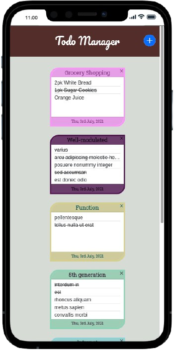
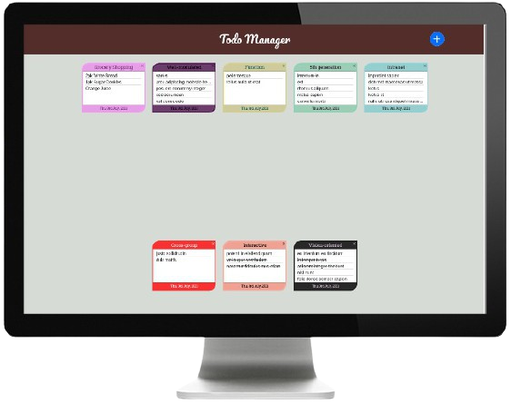

<h1 align="center">
  <br>
  <a href="https://nhope123.github.io/todo-list/"></a>
  <br>
  Todo Manager
  <br>
</h1>


<h4 align="center">Online Todo list manager.</h4>


<p align="center">
  <a href="#key-features">Key Features</a> •
  <a href="#how-to-use">How To Use</a> •
  <a href="#validation">Validation</a> •
  <a href="#credits">Credits</a> •
  <a href="#authors">Authors</a> •
  <a href="#license">License</a>
</p>

<div align='center' >
     
  
</div>

<h2 id='key-features' >Key Featuures</h2>

- Create a Todo list containing:
	+ Title
	+ Creation date
	+ List of tasks
	+ Custom background color
	+ Custom font color
- Add Todo list to collection	
- Removing existing Todo list
- Local persistent storage of Todo list collection

<h2 id='how-to-use' >How To Use</h2>

1. Run [online live](https://nhope123.github.io/todo-manager/) version.
2. Clone and run this application. You'll need [Git](https://git-scm.com) and [Node.js](https://nodejs.org/en/download/) (which comes with [npm](http://npmjs.com)) installed on your computer. From your command line:

```bash
# Clone this repository
$ git clone https://github.com/nhope123/todo-manager.git

# Go into the repository
$ cd todo-manager

# Install dependencies
$ npm install

# Run the app
$ npm start
```
3. View React component documentation

```bash
# Run the documentation
$ npm run styleguidist server
```

Note: If you're using Linux Bash for Windows, [see this guide](https://www.howtogeek.com/261575/how-to-run-graphical-linux-desktop-applications-from-windows-10s-bash-shell/) or use `node` from the command prompt.

<h2 id='validation' >Validation</h2>

+ [mobile friendly test](https://search.google.com/test/mobile-friendly?id=bMQlVCCU8iGe8_vn_X9ZGg)
+ [HTML Validation](https://validator.w3.org/nu/?doc=https%3A%2F%2Fnhope123.github.io%2Ftodo-manager%2F)

<h2 id='credits' >Credits</h2> 

This software uses the following open source packages:

- [React](https://reactjs.org/) - A JavaScript library for building user interfaces.
- [Redux.js](https://redux.js.org/) - A Predictable State Container for JS Apps.
- [Redux-Toolkit.js](https://redux-toolkit.js.org/) - The official toolset for efficient Redux development.
- [React-router-dom](https://www.npmjs.com/package/react-router-dom) - React-router dom binding.
- [Node.js](https://nodejs.org/) - An asynchronous event-driven JavaScript runtime.
- [Dart Sass](https://sass-lang.com/dart-sass) - Css preprocessor.
- [React-colorful](https://www.npmjs.com/package/react-colorful) - Tiny color picker component for React.
- [React Bootsrap icons](https://www.npmjs.com/package/react-bootstrap-icons) - Free svg icons personal use.
- [Bootstrap](https://getbootstrap.com/) - Css framework.
- [icon-icons](https://icon-icons.com/) - Free icons for personal and commercial use.
- [Moment.js](https://www.npmjs.com/package/moment) - A JavaScript date library for parsing, validating, manipulating, and formatting dates.
- [Uuid](https://www.npmjs.com/package/uuid) - RFC4122 UUIDs creation.
- [React-styleguidist.js](https://react-styleguidist.js.org/) - React component live documentation.

<h2 id='authors' >Authors</h2>

+ [Nial Hope](https://github.com/nhope123) - Repository
  + [Portfolio](https://nhope123.github.io/)
  + [Linkedin](https://www.linkedin.com/in/nialhope/)

<h2 id='license' >License</h2>

Creole Food is an open source software licensed as [GNU General Public License v3.0](LICENSE).


